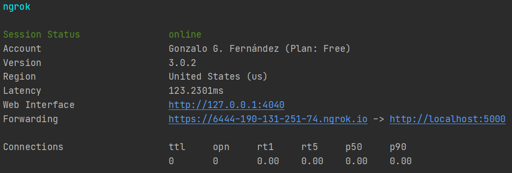

# WhatsApp bot for currency conversion with Twilio service

Simple Whatsapp bot for currency conversion using Twilio service and ExchangeRate-API

## Features

- Language detection of the incoming messages via [fastText](https://fasttext.cc/) package
- Updated currency conversion values thanks to [ExchanRate-API](https://www.exchangerate-api.com/)

## Dependencies

- Developed with Python 3.7
- Flask, since we create a web application that reply to incoming WhatsApp messages
- ngrok, to connect the Flask application in the local system to a public URL that Twilio can connect to 
  (needed in the development version at least, because the computer running the app is likely behind a router or 
  firewall, so it isn’t directly reachable on the Internet)
- A smartphone with an active phone number and WhatsApp installed
- A Twilio account
- ExchangeRate-API API key.

## Installation

To be able to run the python web application, you can install all dependencies automatically by running:

```shell
pip install requirements.txt
```

FastText distributes two models for language identification, which can recognize 176 languages, those are:
- lid.176.bin, which is faster and slightly more accurate, but has a file size of 126MB ;
- lid.176.ftz, which is the compressed version of the model, with a file size of 917kB.

In this project we use `lid-176.bin`. See 
[Language identification](https://fasttext.cc/docs/en/language-identification.html) in fastText website.

## Usage

In order to make the bot works, you'll need a ExchangeRate-API API key. Once you get one, 
put it in a `config.py` python file in the project as follows:

```python
API_KEY = "XXXXXXXXXXXXXXXXXXXXXX"
```

Twilio provides a WhatsApp sandbox, connect your smartphone to the sandbox. See Twilio resources and 
documentation for this.

Run the python web application:

```sh
python main.py
```

The service is now running as a private service on port 5000 in the local system and will sit there waiting 
for incoming connections. 

In another shell, run ngrok to allocate a temporary public domain that redirects HTTP requests to our local port 5000.

```shell
ngrok http 5000
```

You'll get something like this:



Where the forwarding URL is something like `https://XXXXXXXXXXX.ngrok.io`.

## Resources and bibliography

- [Build a WhatsApp Chatbot With Python](https://www.twilio.com/blog/build-a-whatsapp-chatbot-with-python-flask-and-twilio)
from Twilio Blog

## Author and Institution
Gonzalo G. Fernández [ggfernandez@unbosque.edu.co](mailto:ggfernandez@unbosque.edu.co) [fernandez.gfg@gmail.com](mailto:fernandez.gfg@gmail.com)

Sistemas Inteligantes - Programa de Ingeniería de Sistemas - Universidad El Bosque, Bogotá, Colombia.
